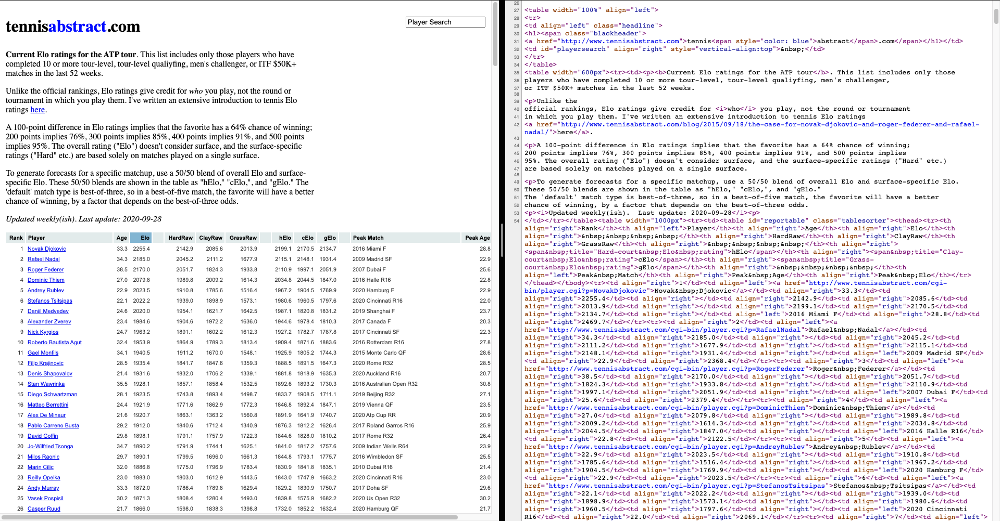
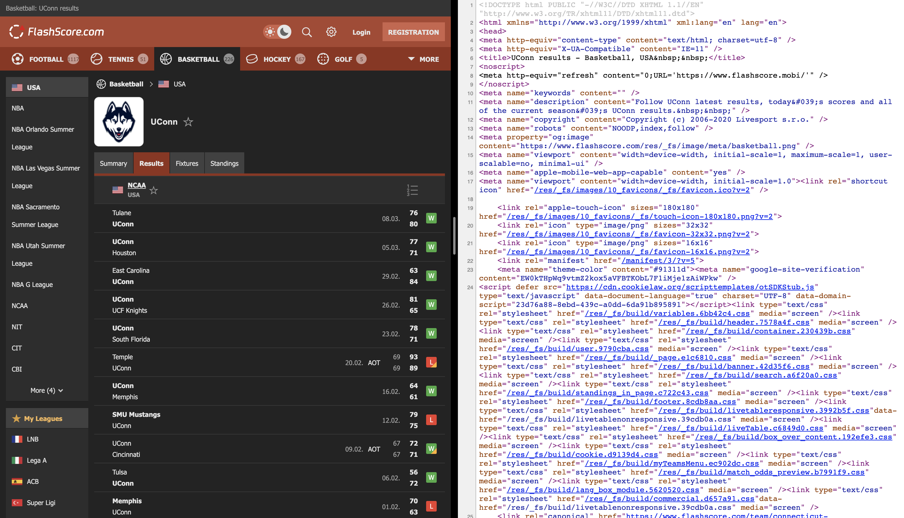

```{r setup, include=FALSE}
options(htmltools.dir.version = FALSE)
knitr::opts_chunk$set(echo = FALSE, eval = TRUE,
                      warning = FALSE, message = FALSE,
                      dev = 'svg')
```

```{r xaringan-themer, include=FALSE, warning=FALSE}
library(xaringanthemer)
style_duo_accent(
    primary_color   = "#000E2F",
    secondary_color = "#7C878E",
    header_color    = "#000E2F",
    text_color      = "#000E2F",
    base_font_size  = "25px",
    ## code_inline_color = colorspace::lighten(gray),
    ## text_bold_color = colorspace::lighten(gray),
    link_color = "",
    header_font_google = google_font("Proxima Nova"),
    text_font_google   = google_font("Helvetica"),
    code_font_google   = google_font("Fira Mono")
)
```

```{r pkgs, include=FALSE, warning=FALSE}
library(xaringanthemer)
library(rvest)
library(dplyr)
library(ggplot2)
```


## Outline

* Intro
* Basic notions about `HTML`
* The `rvest` package
* Examples and Exercises

---

class: center, middle, inverse

# Introduction

---

## Introduction

--

* Web scraping technique is used for capturing data from websites.

--

* It is extremely useful for extracting unstructured data (e.g. text data)
  and/or data available **only** through web pages.

--

* A reproducible way of capturing data online
  
--
  
> Web scraping scripts need to be updated periodically, it is common for these
> scripts to become deprecated due to unexpected changes on the websites where
> they are contained.

---

## Introduction

* The two most popular `R` packages for web scraping are the
  [`rvest`](https://rvest.tidyverse.org/) and the
  [`RSelenium`](https://docs.ropensci.org/RSelenium/).
  
--

* The latter is more flexible and, consequently, more complicated to deal
  with. It requires us to set up a local server, and the process to do so
  depends on your OS. One option to make it work independently of the OS is to
  us [Docker](https://docs.ropensci.org/RSelenium/). This topic is not in the
  scope of this course.
  
--
  
* Here we will focus on `rvest` which follows the "tidyverse" structure and
  style.

---

## Prerequisites

* Having experience with `R`

* A laptop with `R` and Rstudio installed
 
* `rvest`, `dplyr`, and `ggplot2` packages will be needed. To install the
  packages run  
  
```{r install_pkgs, echo = TRUE, eval = FALSE}
install.packages(c("rvest", "dplyr", "ggplot2"),
                 repos = "https://cloud.r-project.org/")
```

---

class: middle, center, inverse

# Basic notions about `HTML`

---

## What is `HTML`?


* `HTML` stands for *Hipertext Markup Language*

--

* It's a language used to "build" (or represent) websites.

--

* When we open a website using a web browser it translates the `HTML` code into
  a visual representation.

--

* There are many technologies used jointly with `HTML` to make websites look
  nicer and, sometimes, safer. Some examples are `javascript` and `CSS`.

---

## How does a `.html` file looks like?

```
<!DOCTYPE html>

<html>
  <head>
    <title>Hello World!</title>
  </head>
  <body>
    <b>Hello World!</b>
  </body>
</html>
```

> Example from https://jakobtures.github.io/web-scraping/html.html .

--

<!-- * There are many elements in `html`. We do not have time to cover all of -->
<!--   them. Let's focus on some important tags that might be useful to extract data. -->

---

## Tags, ids, classes, attributes
  
* **html** 
    - The whole content of a website is usually part of this tag.
* **head** 
    - Contains metadata abou the page/document. For instance, its title and
      helper scripts in other languages, such as `js` and `css`.
* **title** 
    - Title of the page.
* **body** 
    - Primary visual content. Everything not within the header is usually
      included under this tag.
* **h1, h2, h3, h4** 
    - Different levels of headers within the document. 
* **p** 
    - a paragraph.
* **ul, ol, li** 
    - unerdered, and ordered lists and their elements.

---

## Tags, ids, classes, attributes

Each one of the previously displayed tags might have their own "ids", "classes",
and "attributes". The ids and classes will be responsible to customize different
tags. For example, the web developer might want to define a different style for
some paragraphs. This can be done using id's and/or classes.

---

## Static and Dynamic Data

* Most of data in the web are not organized into files, which can be directly
  imported into R.

* Before we capture these data, we need to determine whether the data are static
  or dynamic based on the source code.

* Static data is the data that can be seen in the source code.

* We cannot see the dynamic data in the source code.

---

## Static Data and Dynamic Data

* The source code can be accessed by View $\rightarrow$ Developer $\rightarrow$
  View Source in Chrome. Or right click the website and choose "View Page
  Source".


---

## Static Data and Dynamic Data

Exercise: Determine what kind of the data are in the following examples, static
or dynamic.

* http://tennisabstract.com/reports/atp_elo_ratings.html

* https://www.flashscore.com/team/connecticut-huskies/8rqVf3Tj/results/


---

## Static Data and Dynamic Data



This is static data.

---

## Static Data and Dynamic Data



This is dynamic data.

---

class: middle, center, inverse

# The `rvest` package

---

## Example

[College basketball school index](https://www.sports-reference.com/cbb/schools/)

* These data can be obtained by copying and pasting manully.

* Web scraping technique helps capture the data efficiently.


## Web Scraping Using R

* Different web scraping techniques are required when we are facing different kinds of data.

* Data have been organized into files.

  - Directly download it and read it in R

* Data are contained in HTML pages.

  - Static data
  - Dynamic data

## Import Data Files from Websites

* These files that can be read by **read.csv** or related functions.

* They can be directly imported from a URL.

- Example: we extract the most recent Australian Open Tennis Championships match [(AUS Open)](http://www.tennis-data.co.uk/ausopen.php):

```{r echo=TRUE, message=FALSE, warning=FALSE, results='hide', eval = FALSE}
url <- "http://www.tennis-data.co.uk/2020/ausopen.csv"
tennis_aus <- read.csv(url)
str(tennis_aus)
```

---


---

## Web Scraping for Static Data in R

R provides several approaches for web scraping the static data. Two of them will be discussed in this workshop.

* **readLines** function: Read the source code of the HTML pages.

* **rvest** package: Capture useful data by identifying the elements contains the data in the source code. 

---

## Web Scraping for Static Data in R

Use **readLines** function for [College basketball school index](https://www.sports-reference.com/cbb/schools/). 

```{r echo=TRUE, message=FALSE, warning=FALSE, eval = FALSE}
web_page <- readLines("https://www.sports-reference.com/cbb/schools/")
head(web_page, n = 10L)
```

* Gives the source code.

* Needs data cleaning and organization.

---


## Web Scraping for Static Data in R

Before we talk about web scraping by **rvest** package, we need to know how to locate the elements containing the data in the source code.

* Right click the page and choose "Inspect".

* Click "Select an element in the page to inspect it".

* We can locate the elements by CSS selector or XPATH.

---

## Web Scraping for Static Data in R

Use http://tennisabstract.com/reports/atp_elo_ratings.html as an example

* CSS selector: id = "reportable", class = "tablesorter"


---

## Web Scraping for Static Data in R

* XPATH: '//*[@id="reportable"]'


---

## Web Scraping for Static Data in R

Next, we are going to talk about how to use **rvest** for web scraping by using an example.


* Install **rvest** package from cran.

\footnotesize
```{r pckgs, eval=FALSE, echo=TRUE, eval = FALSE}
install.packages("rvest", repos = "http://cran.us.r-project.org")
require("rvest")
```

---

## Web Scraping for Static Data in R

* Web scraping data from http://tennisabstract.com/reports/atp_elo_ratings.html


```{r echo=TRUE, message=FALSE, warning=FALSE, eval = FALSE}
url_elo <- "http://tennisabstract.com/reports/atp_elo_ratings.html"
webpage <- read_html(url_elo)
elo_class <- webpage %>% 
  html_nodes(".tablesorter") %>% 
  html_table()
elo_id <- webpage %>% 
  html_nodes("#reportable") %>% 
  html_table()
identical(elo_class, elo_id)
```

---

## Web Scraping for Static Data in R


```{r echo=TRUE, message=FALSE, warning=FALSE, eval = FALSE}
elo_xpath <- webpage %>% 
  html_nodes(xpath = '//*[@id="reportable"]') %>% 
  html_table()
identical(elo_class, elo_xpath)
head(elo_class[[1]])
```

---

## Web Scraping for Static Data in R

* Except **html_nodes** and **html_table**, there are many other frequently used functions in **rvest**.

  - **html_node** : extract element
  - **html_text** : extract text
  - **html_attrs** : extract attributes
  - **html_form** : extract forms

* Please look up [rvest cran](https://cran.r-project.org/web/packages/rvest/rvest.pdf) for more information.

* [SelectorGadget](https://cran.r-project.org/web/packages/rvest/vignettes/selectorgadget.html) is a convenient tool to identify CSS selector.

---

## Web Scraping for Dynamic Data in R

* What dynamic data display in the website can be changed in response to the user interaction. 

* We need to automate the web browsing process in R for the dynamic data.

* **RSelenium** package helps this automating process by providing connection to Selenium Server.

* Install **RSelenium** package.

\footnotesize
```{r eval=FALSE, message=FALSE, warning=FALSE, echo = TRUE}
devtools::install_github("ropensci/RSelenium")
require("RSelenium")
```

\normalsize

---

## Web Scraping for Dynamic Data in R

* Use **RSelenium** to extract data on [2017 Australian Open Final](http://www.flashscore.com/match/Cj6I5iL9/#match-statistics;0)


---

## Web Scraping for Dynamic Data in R

* Connect to a selenium server and open brower.

```{r eval=FALSE, message=FALSE, warning=FALSE, echo = TRUE}
rD <- rsDriver(port = 5561L, chromever = "85.0.4183.87")
remDr <- rD$client
```

* Extract Information and organize data.

```{r eval=FALSE, message=FALSE, warning=FALSE, echo = TRUE}
url <- "http://www.flashscore.com/match/Cj6I5iL9/#match-statistics;0"
remDr$navigate(url)
webElem <- remDr$findElements(using = 'class', "statBox")
webElem <- unlist(lapply(webElem, function(x){x$getElementText()}))[[1]]
# head(unlist(strsplit(webElem, split = '\n')))
remDr$close()
```

\normalsize

---

## Web Scraping for Dynamic Data in R

* Frequently used functions of **RSelenium**:

  - rsDriver() : start a selenium server
  - navigate() : navigate web pages
  - findElements() : find elements by CSS seclector or XPATH
  - getPageSource() : get current page source
  - clickElement() : click element
  
* Please go to [RSelenium cran](https://cran.r-project.org/web/packages/RSelenium/RSelenium.pdf) for more details.

---

## Web Scraping for Dynamic Data in R

Exercise: Web Scraping for the history basketball recording of UConn

https://www.flashscore.com/team/connecticut-huskies/8rqVf3Tj/results/

* Start a selenium server and open web brower.

```{r eval=FALSE, message=FALSE, warning=FALSE, echo = TRUE}
require("RSelenium")
rD <- rsDriver(port = 5533L, chromever = "85.0.4183.87")
remDr <- rD$client
url <- "https://www.flashscore.com/team/connecticut-huskies/8rqVf3Tj/results/#"
remDr$navigate(url)
```
\normalsize

---

## Web Scraping for Dynamic Data in R

* Automate to click all "show more results".

```{r eval=FALSE, message=FALSE, warning=FALSE, echo = TRUE}
repeat{
  b <- tryCatch({
    suppressMessages({
      webElemMore <- remDr$findElement(using = 'xpath', 
                        '//*[@id="live-table"]/div[1]/div/div/a')
      webElemMore$clickElement()
    })
  }, error = function(e) e)
  if(inherits(b, "error")) break
}
```

* Extract data, such as time, home/away, score and result.

```{r eval=FALSE, message=FALSE, warning=FALSE, echo = TRUE}
webElemTime <- remDr$findElements(using = 'xpath', 
                              '//*[@class="event__time"]')
webElemTime <- 
  unlist(lapply(webElemTime, function(x){x$getElementText()}))
webElemTime <- gsub("\\n", " ", webElemTime)
```

---

## Web Scraping for Dynamic Data in R

```{r eval=FALSE, message=FALSE, warning=FALSE, echo = TRUE}
webElemHome <- 
  remDr$findElements(using = 'class', 
                     'event__participant')
webElemHome <- 
  unlist(lapply(webElemHome, function(x){x$getElementText()}))
webElemScore <- 
  remDr$findElements(using = 'class', 'event__score')
webElemScore <- 
  unlist(lapply(webElemScore, function(x){x$getElementText()}))
webElemResult <- 
  remDr$findElements(using = 'class', 'wld')
webElemResult <- 
  unlist(lapply(webElemResult, function(x){x$getElementText()}))
```

---

## Web Scraping for Dynamic Data in R

* Organize dataset.

```{r eval=FALSE, message=FALSE, warning=FALSE, echo = TRUE}
n <- length(webElemHome)
basketball <- 
  data.frame(time = webElemTime,
             Home = webElemHome[seq(n) %% 2 == 1],
             Away = webElemHome[seq(n) %% 2 == 0],
             HomeS = webElemScore[seq(n) %% 2 == 1],
             AwayS = webElemScore[seq(n) %% 2 == 0],
             Result = webElemResult)
head(basketball)
remDr$close()
```


---

## Summary

* For different kinds of data, we need to use different web scraping techiniques with R.

* One can simply use **read.csv** or related functions to directly import organized files from web pages.

* The static data can be extract with the help of **rvest**.

* We could use **RSelenium** to parse the dynamic data.

---

## Resources

- [CSS and HTML crash course](http://flukeout.github.io/)

- [rvest](https://rvest.tidyverse.org/)

- [RSelenium](https://cran.r-project.org/web/packages/RSelenium/vignettes/basics.html)

- [R task view: web technology](https://cran.r-project.org/web/views/WebTechnologies.html)


---

## Acknowledgement

This slides are modified from [Dr. Kovalchik's
material](https://github.com/skoval/UseRSportTutorial), [Wanwan Xu's
slides](https://github.com/wanwanx/WebScraping_UCSAS), [Yaqiong Yao's
slides](https://github.com/yay17007/UCSAS_WebScrapping).

---
