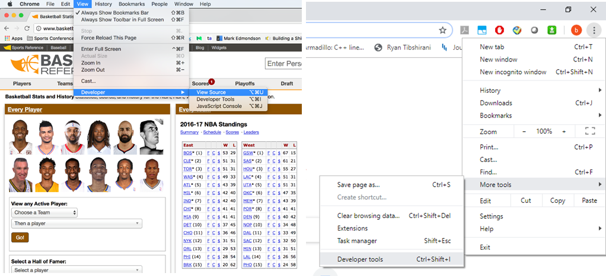
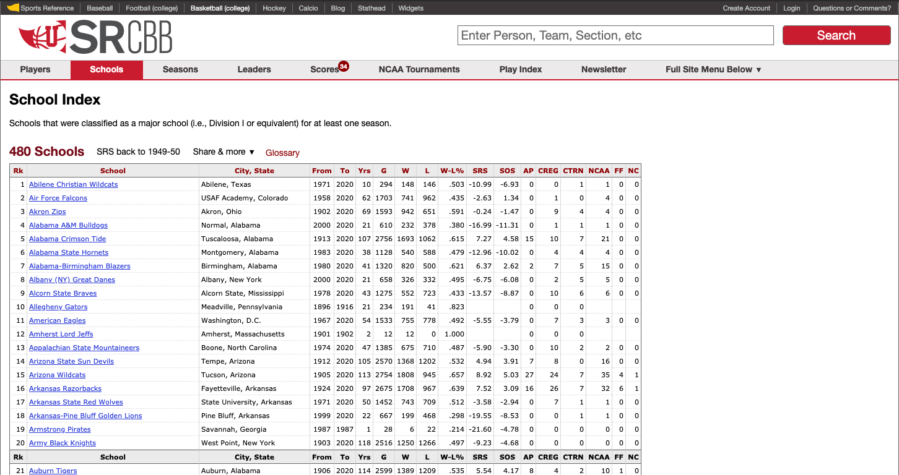
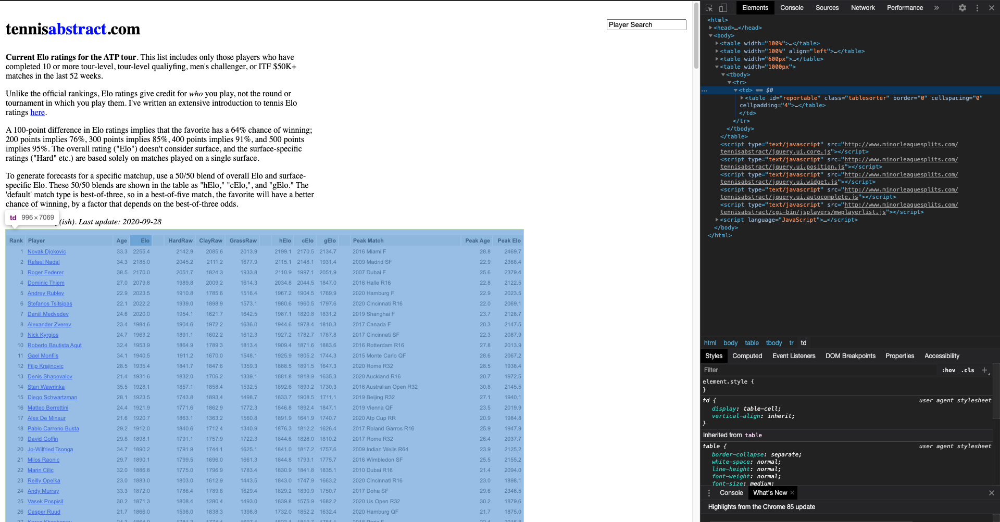
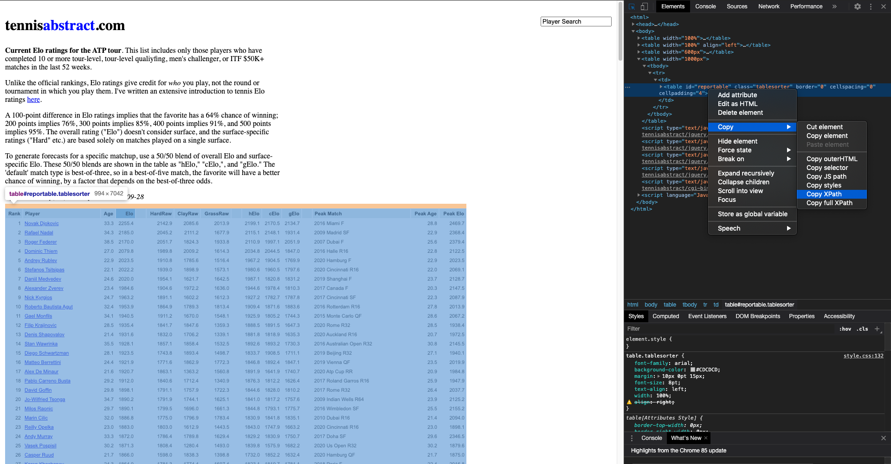
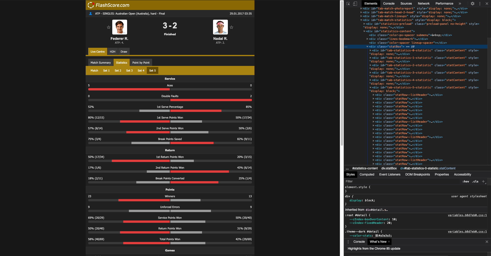
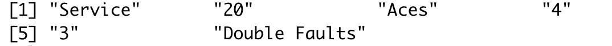
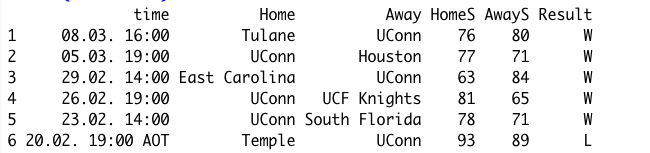

```{r setup, include=FALSE}
options(htmltools.dir.version = FALSE)
knitr::opts_chunk$set(echo = FALSE, eval = TRUE,
                      warning = FALSE, message = FALSE,
                      dev = 'png', dpi = 300)
```

```{r xaringan-themer, include=FALSE, warning=FALSE}
library(xaringanthemer)
style_duo_accent(
    primary_color   = "#000E2F",
    secondary_color = "#7C878E",
    header_color    = "#000E2F",
    text_color      = "#000E2F",
    base_font_size  = "23px",
    ## code_inline_color = colorspace::lighten(gray),
    ## text_bold_color = colorspace::lighten(gray),
    link_color = "#E4002B",
    header_font_google = google_font("Proxima Nova"),
    text_font_google   = google_font("Helvetica"),
    code_font_google   = google_font("Fira Mono")
)
```

```{r pkgs, include=FALSE, warning=FALSE}
library(xaringanthemer)
library(rvest)
library(dplyr)
library(ggplot2)
```

## Outline

* Intro
* Basic notions about `HTML` and web scraping
* The `rvest` package
* Examples and Exercises

---

class: center, middle, inverse

# Introduction

---

## Introduction

--

* Web scraping technique is used for capturing data from websites.

--

* It is extremely useful for extracting unstructured data (e.g. text data)
  and/or data available **only** through web pages.

--

* A reproducible way of capturing data online
  
--
  
> Web scraping scripts need to be updated periodically, it is common for these
> scripts to become deprecated due to unexpected changes on the websites where
> they are contained.

---

## Introduction

* The two most popular `R` packages for web scraping are the
  [`rvest`](https://rvest.tidyverse.org/) and the
  [`RSelenium`](https://docs.ropensci.org/RSelenium/).
  
--

* The latter is more flexible and, consequently, more complicated to deal
  with. It requires us to set up a local server, and the process to do so
  depends on your OS. One option to make it work independently of the OS is to
  us [Docker](https://docs.ropensci.org/RSelenium/). This topic is not in the
  scope of this course.
  
--
  
* Here we will focus on `rvest` which follows the "tidyverse" structure and
  style.

---

## Prerequisites

* Having experience with `R`

* A laptop with `R` and Rstudio installed
 
* `rvest`, `dplyr`, `janitor`, and `ggplot2` packages will be needed. To install the
  packages run  
  
```{r install_pkgs, echo = TRUE, eval = FALSE}
install.packages(c("rvest", "dplyr", "ggplot2", "janitor"),
                 repos = "https://cloud.r-project.org/")
```

---

class: middle, center, inverse

# Basic notions about `HTML` and web scraping

---

## What is `HTML`?


* `HTML` stands for *Hipertext Markup Language*

--

* It's a language used to "build" (or represent) websites.

--

* When we open a website using a web browser it translates the `HTML` code into
  a visual representation.

--

* There are many technologies used jointly with `HTML` to make websites look
  nicer and, sometimes, safer. Some examples are `javascript` and `CSS`.

---

## How does a `.html` file looks like?

The visual representation of the `html` code below can be seen in
[here](https://webscraping-tures.github.io/hello_world.html).

```
<!DOCTYPE html>

<html>
  <head>
    <title>Hello World!</title>
  </head>
  <body>
    <b>Hello World!</b>
  </body>
</html>
```

> Example from https://jakobtures.github.io/web-scraping/html.html .

<!-- * There are many elements in `html`. We do not have time to cover all of -->
<!--   them. Let's focus on some important tags that might be useful to extract data. -->

---

## Tags, ids, classes, attributes
  
* **html** 
    - The whole content of a website is usually part of this tag.
* **head** 
    - Contains metadata abou the page/document. For instance, its title and
      helper scripts in other languages, such as `js` and `css`.
* **title** 
    - Title of the page.
* **body** 
    - Primary visual content. Everything not within the header is usually
      included under this tag.
* **h1, h2, h3, h4** 
    - Different levels of headers within the document. 
* **p** 
    - a paragraph.
* **ul, ol, li** 
    - unordered, and ordered lists and their elements.
* **table, th, tr, td** 
    - Table, table header, table row, and table content, respectively.

---

## Tags, ids, classes, attributes

- Each one of the previously displayed tags might have their own "ids",
  "classes", and "attributes". The ids and classes will be responsible to
  customize different tags.

- For example, the web developer might want to define a different style for some
  specific paragraphs and/or tables. This can be achieved by assigning different
  classes for these tags.
  
- Usually, `css` is used to define these styling options.

---

## Static and Dynamic Data

* Most of data in the web are not organized into files, which can be directly
  imported into R.

* Before we capture these data, we need to determine whether the data are static
  or dynamic based on the source code.

* Unfortunately, there is no general rule to determine wheter the data provided
  by a website is static or dynamic and it needs to be done in a case by case
  basis.

---

## Differences between static and dynamic data

* As the name suggests, static data is static. That is, once the website is
  loaded, all the data is available (even though it might be hidden by some
  button).
  
* Sometimes it is possible to determine wheter the data is static by looking at
  the source code of the webpage. 

* Note that, even if we don't find the data itself in the source code, it might
  be static.

* Most of modern websites rely on servers to store, retrieve, and or manipulate
  the data. Dynamic data is not available until you "request" it by clicking at
  some button or making a search.

---


* Note that, the source code can be accessed by View $\rightarrow$ Developer
  $\rightarrow$ View Source in Chrome. Or right click the website and choose
  "View Page Source".


```{r img_1, out.width = "85%", fig.align = "center"}

```

---

## Web Scraping Using R

* Different web scraping techniques are required when we are facing different
  kinds of data.

* Data have been organized into files.

  - Directly download it and read it in R

* Data are contained in HTML pages.

  - Static data
  - Dynamic data

---

## Import Data Files from Websites

* These files that can be read by **read.csv** or related functions.

* They can be directly imported from a URL.

- Example: we extract the most recent Australian Open Tennis Championships match
  [(AUS Open)](http://www.tennis-data.co.uk/ausopen.php):

```{r echo=TRUE, message=FALSE, warning=FALSE, results='hide', eval = FALSE}
url <- "http://www.tennis-data.co.uk/2020/ausopen.csv"
tennis_aus <- read.csv(url)
str(tennis_aus)
```

---

## Web Scraping for Static Data in R

R provides several approaches for web scraping the static data. Two of them will
be discussed in this workshop.

* **readLines** function: Read the source code of the HTML pages.

* **rvest** package: Capture useful data by identifying the elements contains
  the data in the source code.

---

## Example

.pull-left[

[College basketball school index](https://www.sports-reference.com/cbb/schools/)

* These data can be obtained by copying and pasting manually.

* Web scraping technique helps capture the data efficiently.
]

.pull-right[
```{r img_4, out.width = "90%", fig.align = "center"}

```
]

---

## Web Scraping for Static Data in R

Use **readLines** function for [College basketball school
index](https://www.sports-reference.com/cbb/schools/).

```{r echo=TRUE, message=FALSE, warning=FALSE, eval = FALSE}
web_page <- readLines("https://www.sports-reference.com/cbb/schools/")
head(web_page, n = 10L)
```

* Gives the source code.

* Needs data cleaning and organization using [regular
  expressions](https://en.wikipedia.org/wiki/Regular_expression).

---

## Web Scraping for Static Data in R

Before we talk about web scraping by **rvest** package, we need to know how to
locate the elements containing the data in the source code.

* Right click the page and choose "Inspect".

* Click "Select an element in the page to inspect it".

* We can locate the elements by CSS selector or XPATH.

* [SelectorGadget](https://rvest.tidyverse.org/articles/selectorgadget.html) is
  a convenient tool to identify CSS selector.

---

## Web Scraping for Static Data in R

Use http://tennisabstract.com/reports/atp_elo_ratings.html as an example

.pull-left[

* CSS selector: id = "reportable", class = "tablesorter"

```{r img_6, out.width = "85%", fig.align = "center"}

```
]

.pull-right[

* XPATH: '//*[@id="reportable"]'

```{r img_7, out.width = "85%", fig.align = "center"}

```
]

---

class: middle, center, inverse

# The `rvest` package

---

## `rvest`

- An `R` package that is part of the `tidyverse` "collection" of packages

- The package has only one system dependencie which is the `libxlm2` library. 

- Provides basic functions that enable us to perform a considerable amount of
  common web scraping tasks. For instance, extracting text and/or tables from
  web pages.
  
- What you can do with web scraping will depend on your creativity and how the
  data you want to extract is stored in the "target" website.
  
- Some websites are "protected" against web scraping in the sense that the
  developers of these sites make everything in their power to make it difficult
  to scrape their data. Some examples are betting platforms such as bet365, for
  example.

---

## Basic functions

- For most of the time we will be using only 5 functions from this package.

- `read_html`: reads a web page and stores it into an `R` object of class
  `"xml_document"`.

- `html_element` and `html_elements`: these two functions will be the most
  important ones for most of the examples we work with. Basically, we will use
  these functions to select the "tags" we are interested in. 

- `html_table` parses an `html` table into a `data.frame`

- `html_text` and `html_text2` parses `html` text into character vectors.

---

## Good practices

- Scrape responsabily and, more importantly, respect the data sources.

- Don't try to use web scraping to emulate a "web crawler".

- Collect only what you need.

- Use an API if there is one available. 

- Collect only once if possible.

> From https://jakobtures.github.io/web-scraping/goodpractice.html .

---

class: middle, center, inverse

# Examples


---

## FIFA World Cup (Wikipedia)

* Web scraping data from https://en.wikipedia.org/wiki/FIFA_World_Cup .

```{r wiki, echo = TRUE, eval = TRUE, message = FALSE}
library(dplyr)
library(ggplot2)
library(rvest)

## website url
url_wiki <- 'https://en.wikipedia.org/wiki/FIFA_World_Cup'
## xpath for table
xpt_wiki <- '/html/body/div[3]/div[3]/div[5]/div[1]/table[3]'

## reading html
page_wiki <- read_html(url_wiki)
```

---

## FIFA World Cup (Wikipedia)

.pull-left[
```{r wiki2, echo = TRUE, eval = FALSE}
## all the text from the webpage
{{ page_wiki |> }}
{{     html_elements("p") |> }}
{{     html_text2() }}

## all the tables from the page
page_wiki |>
    html_elements("table") |>
    html_table()
```
]

.pull-right[
```{r wiki3, echo = FALSE, eval = TRUE}
## text from the webpage
page_wiki |> 
    html_elements("p") |>
    html_text2() -> yy
head(yy)
```
]

---

## FIFA World Cup (Wikipedia)

.pull-left[
```{r wiki4, echo = TRUE, eval = FALSE, class.output = "bg-danger"}
## all the text from the webpage
page_wiki |>
    html_elements("p") |>
    html_text2()

## all the tables from the page
{{ page_wiki |> }}
{{     html_elements("table") |> }}
{{     html_table() }}
```
]

.pull-right[
```{r wiki5, echo = FALSE, eval = TRUE}
## text from the webpage
page_wiki |> 
    html_elements("table") |>
    html_table() -> xx

xx[[1]]
```
]

---

## FIFA World Cup (Wikipedia)

```{r wiki6, echo = TRUE, eval = TRUE}
## selecting an specific table
tbl_wiki <-
    page_wiki |>
    html_element(xpath = xpt_wiki) |>
    html_table(dec = ",")

## dealing with double header
names(tbl_wiki) <- as.character(tbl_wiki[1, ])
tbl_wiki <- tbl_wiki[-1, ]

## removing "overall" row
tbl_wiki <- tbl_wiki[-nrow(tbl_wiki), ]

tbl_wiki <- janitor::clean_names(tbl_wiki)
```

---

## FIFA World Cup (Wikipedia)

```{r wiki_add, eval = TRUE, echo = TRUE}
tbl_wiki <-
    tbl_wiki |>
    mutate_at(c(1, 4:6), ~ as.numeric(gsub(",", "", .))) |>
    mutate(number = as.numeric(substr(gsub(",", "", number), 1, 6)))
```

---

## FIFA World Cup (Wikipedia)

.pull-left[
```{r wiki7, echo = TRUE, eval = FALSE}
ggplot(data = tbl_wiki,
       aes(x = year, y = avg_attendance)) +
    geom_line(lwd = 1.1) +
    geom_label(aes(label = hosts)) +
    theme_bw() +
    labs(x = "Year", y = "Avg. attendance")
```
]

.pull-right[
```{r wiki8, echo = FALSE, eval = TRUE, out.width = "85%"}
ggplot(data = tbl_wiki,
       aes(x = year, y = avg_attendance)) +
    geom_line(lwd = 1.1) +
    geom_label(aes(label = hosts)) +
    theme_bw() +
    labs(x = "Year", y = "Avg. attendance")
```
]

---

## FIFA World Cup (Wikipedia)


.pull-left[
```{r wiki9, echo = TRUE, eval = FALSE}
ggplot(data = tbl_wiki,
       aes(x = year, y = number)) +
    geom_line(lwd = 1.1) +
    ## geom_label(aes(label = gsub(",", "\n",venue))) +
    geom_label(aes(label = hosts)) +
    theme_bw() +
    labs(x = "Year", y = "Max. attendance")
```
]

.pull-right[
```{r wiki10, echo = FALSE, eval = TRUE, out.width = "85%"}
ggplot(data = tbl_wiki,
       aes(x = year, y = number)) +
    geom_line(lwd = 1.1) +
    ## geom_label(aes(label = gsub(",", "\n",venue))) +
    geom_label(aes(label = hosts)) +
    theme_bw() +
    labs(x = "Year", y = "Max. attendance")

```
]

---

class: middle

## Exercise: Use `rvest` to load the table containing the top goal scorers in the Wikipedia page from the previous example.

---

## ATP tour Elo ratings

* Web scraping data from http://tennisabstract.com/reports/atp_elo_ratings.html

```{r echo=TRUE, message=FALSE, warning=FALSE, eval = FALSE}
url_elo <- "http://tennisabstract.com/reports/atp_elo_ratings.html"
webpage <- read_html(url_elo)

{{ webpage }}
```

---


```{r echo=FALSE, message=FALSE, warning=FALSE, eval = TRUE}
url_elo <- "http://tennisabstract.com/reports/atp_elo_ratings.html"
webpage <- read_html(url_elo)

webpage 
```

---

## ATP tour Elo ratings

* Web scraping data from http://tennisabstract.com/reports/atp_elo_ratings.html

```{r echo=TRUE, message=FALSE, warning=FALSE, eval = FALSE}
url_elo <- "http://tennisabstract.com/reports/atp_elo_ratings.html"
webpage <- read_html(url_elo)

webpage

elo_class <- webpage |>
  html_element(".tablesorter") |>
  html_table()

{{ elo_class }}
```

---

```{r echo=FALSE, message=FALSE, warning=FALSE, eval = TRUE}
elo_class <- webpage |>
  html_element(".tablesorter") |>
  html_table()

head(elo_class)
```

---

## ATP tour Elo ratings

* Web scraping data from http://tennisabstract.com/reports/atp_elo_ratings.html

```{r echo=TRUE, message=FALSE, warning=FALSE, eval = FALSE}
url_elo <- "http://tennisabstract.com/reports/atp_elo_ratings.html"
webpage <- read_html(url_elo)

webpage

elo_class <- webpage |>
  html_element(".tablesorter") |>
  html_table()

elo_id <- webpage |>
  html_element("#reportable") |>
  html_table()

{{ elo_id }}
```

---

```{r echo=FALSE, message=FALSE, warning=FALSE, eval = TRUE}
elo_id <- webpage |>
  html_element("#reportable") |>
  html_table()

head(elo_id)
```

---

## College Football

* Web scraping data from http://www.cfbstats.com/2009/leader/national/team/offense/split01/category09/sort01.html .

.pull-left[
```{r cf1, echo = TRUE, eval = FALSE}
url_cf  <- "http://www.cfbstats.com/2009/leader/national/team/offense/split01/category09/sort01.html"
page_cf <- read_html(url_cf)

cg_2009 <-
    page_cf |>
    html_element("table") |>
    html_table() |>
    janitor::clean_names() |>
    rename("rank" = "x")

{{ head(cg_2009) }}
```
]

.pull-right[
```{r cf2, echo = FALSE, eval = TRUE}
url_cf  <- "http://www.cfbstats.com/2009/leader/national/team/offense/split01/category09/sort01.html"
page_cf <- read_html(url_cf)

cg_2009 <-
    page_cf |>
    html_element("table") |>
    html_table() |>
    janitor::clean_names() |>
    rename("rank" = "x")

head(cg_2009)
```
]

---

## College Football

* Sometimes, the URL of the website we are scraping follow some patterns. For
  example, for this example we can see the year as a parameter in the URL, that
  is
  _http://www.cfbstats.com/**2009**/leader/national/team/offense/split01/category09/sort01.html_
  
* In this case, specifically, we can just change the year in the url to scrape
  data from a different year. Take a look at the chunk of code below and compare
  it to the url stored in the `url_cf` object.
  
```{r example_cf, echo = TRUE, eval = FALSE}
url_cf2  <- "http://www.cfbstats.com/2010/leader/national/team/offense/split01/category09/sort01.html"
```

---

class: middle

## Exercise: Use what we have learned so far to scrape the stats for every year between 2009 and 2020 in the  College Fooball example

---

## Solution

```{r my_solution, echo = TRUE, eval = TRUE}
urls_aux <- "http://www.cfbstats.com/%d/leader/national/team/offense/split01/category09/sort01.html"

tables_cf <- lapply(2009:2020,
                    function(x, .url) {
                        url <- sprintf(.url, x)
                        
                        out <- read_html(url) |>
                            html_element("table") |>
                            html_table() |>
                            janitor::clean_names() |>
                            rename("rank" = "x") |>
                            mutate(year = x) |>
                            select(rank, year, name, everything())

                        return(out)
                    }, .url = urls_aux)

final_table <- bind_rows(tables_cf)
```

---

```{r plot_solution, echo = FALSE, eval = TRUE, fig.align = "center", fig.height = 4, fig.width = 8}
uconn_years <- final_table |>
    filter(name == "Connecticut")

ggplot(data = uconn_years,
       aes(x = year, y = rank)) +
    geom_point() +
    geom_line() +
    scale_y_reverse(limits = c(130, 0), breaks = c(130, 100, 50, 10, 1)) +
    scale_x_continuous(breaks = c(2009, 2014, 2019)) +
    theme_bw() +
    labs(x = "Year", y = "Rank", title = "UConn")
```

---

class: middle

## Exercise: web scrape the tables from this url https://www.baseball-almanac.com/teamstats/schedule.php?y=2014&t=BOS for different years. 

---


## Web Scraping for Dynamic Data in R

* What dynamic data display in the website can be changed in response to the
  user interaction.

* We need to automate the web browsing process in R for the dynamic data.

* **RSelenium** package helps this automating process by providing connection to
  Selenium Server.

* This package requires us to set up a local server, this process varies with
  the OS you're using. The authors right now recommend using docker to do
  so. For more information see [this
  link](https://docs.ropensci.org/RSelenium/articles/docker.html)

* Install **RSelenium** package.

```{r eval=FALSE, message=FALSE, warning=FALSE, echo = TRUE}
install.packages("RSelenium")
library("RSelenium")
```

---

## Web Scraping for Dynamic Data in R

* Use **RSelenium** to extract data on [2017 Australian Open
  Final](http://www.flashscore.com/match/Cj6I5iL9/#match-statistics;0)

```{r img_87, out.width = "85%", fig.align = "center"}

```

---

## Web Scraping for Dynamic Data in R

.pull-left[
* Connect to a selenium server and open brower. (This varies according to your
  operational system)

```{r eval=FALSE, message=FALSE, warning=FALSE, echo = TRUE}
rD <- rsDriver(port = 5561L, chromever = "85.0.4183.87")
remDr <- rD$client
```

* Extract Information and organize data.

```{r eval=FALSE, message=FALSE, warning=FALSE, echo = TRUE}
url <- "http://www.flashscore.com/match/Cj6I5iL9/#match-statistics;0"
remDr$navigate(url)
webElem <- remDr$findElements(using = 'class', "statBox")
webElem <- unlist(lapply(webElem, function(x){x$getElementText()}))[[1]]
# head(unlist(strsplit(webElem, split = '\n')))
remDr$close()
```
]

.pull-right[
```{r img_88, out.width = "85%", fig.align = "center"}

```
]

---

## Web Scraping for Dynamic Data in R

* Frequently used functions of **RSelenium**:

  - rsDriver() : start a selenium server
  - navigate() : navigate web pages
  - findElements() : find elements by CSS seclector or XPATH
  - getPageSource() : get current page source
  - clickElement() : click element
  
* Please go to [RSelenium
  cran](https://cran.r-project.org/web/packages/RSelenium/RSelenium.pdf) for
  more details.

---

## Web Scraping for Dynamic Data in R

Exercise: Web Scraping for the history basketball recording of UConn

https://www.flashscore.com/team/connecticut-huskies/8rqVf3Tj/results/

* Start a selenium server and open web brower.

```{r eval=FALSE, message=FALSE, warning=FALSE, echo = TRUE}
require("RSelenium")
rD <- rsDriver(port = 5533L, chromever = "85.0.4183.87")
remDr <- rD$client
url <- "https://www.flashscore.com/team/connecticut-huskies/8rqVf3Tj/results/#"
remDr$navigate(url)
```

---

## Web Scraping for Dynamic Data in R

.pull-left[
* Automate to click all "show more results".

```{r eval=FALSE, message=FALSE, warning=FALSE, echo = TRUE}
repeat{
  b <- tryCatch({
    suppressMessages({
      webElemMore <- remDr$findElement(using = 'xpath', 
                        '//*[@id="live-table"]/div[1]/div/div/a')
      webElemMore$clickElement()
    })
  }, error = function(e) e)
  if(inherits(b, "error")) break
}
```
]

--

.pull-right[
* Extract data, such as time, home/away, score and result.

```{r eval=FALSE, message=FALSE, warning=FALSE, echo = TRUE}
webElemTime <- remDr$findElements(using = 'xpath', 
                              '//*[@class="event__time"]')
webElemTime <- 
  unlist(lapply(webElemTime, function(x){x$getElementText()}))
webElemTime <- gsub("\\n", " ", webElemTime)
```
]

---

## Web Scraping for Dynamic Data in R

```{r eval=FALSE, message=FALSE, warning=FALSE, echo = TRUE}
webElemHome <- 
  remDr$findElements(using = 'class', 
                     'event__participant')
webElemHome <- 
  unlist(lapply(webElemHome, function(x){x$getElementText()}))
webElemScore <- 
  remDr$findElements(using = 'class', 'event__score')
webElemScore <- 
  unlist(lapply(webElemScore, function(x){x$getElementText()}))
webElemResult <- 
  remDr$findElements(using = 'class', 'wld')
webElemResult <- 
  unlist(lapply(webElemResult, function(x){x$getElementText()}))
```

---

## Web Scraping for Dynamic Data in R

.pull-left[

* Organizing dataset.

```{r eval=FALSE, message=FALSE, warning=FALSE, echo = TRUE}
n <- length(webElemHome)
basketball <- 
  data.frame(time = webElemTime,
             Home = webElemHome[seq(n) %% 2 == 1],
             Away = webElemHome[seq(n) %% 2 == 0],
             HomeS = webElemScore[seq(n) %% 2 == 1],
             AwayS = webElemScore[seq(n) %% 2 == 0],
             Result = webElemResult)
head(basketball)
remDr$close()
```
]

.pull-right[
```{r img_89, out.width = "85%", fig.align = "center"}

```
]

---

## Summary

* For different kinds of data, we need to use different web scraping techiniques
  with R.

* One can simply use **read.csv** or related functions to directly import
  organized files from web pages.

* The static data can be extract with the help of **rvest**.

* We could use **RSelenium** to parse the dynamic data.

---

## Resources

- [CSS and HTML crash course](http://flukeout.github.io/)

- [rvest](https://rvest.tidyverse.org/)

- [RSelenium](https://cran.r-project.org/web/packages/RSelenium/vignettes/basics.html)

- [R task view: web
  technology](https://cran.r-project.org/web/views/WebTechnologies.html)


---

## Acknowledgement

This slides are modified from [Dr. Kovalchik's
material](https://github.com/skoval/UseRSportTutorial), [Wanwan Xu's
slides](https://github.com/wanwanx/WebScraping_UCSAS), [Yaqiong Yao's
slides](https://github.com/yay17007/UCSAS_WebScrapping), and [Jakob Tures's
book](https://jakobtures.github.io/web-scraping/index.html)

---

class:: middle, center, inverse

# Get in touch!

## `r fontawesome::fa("globe")` [lcgodoy.me](lcgodoy.me)

## `r fontawesome::fa("twitter")` [ldcgodoy](https://twitter.com/ldcgodoy)

## `r fontawesome::fa("github")` [lcgodoy](https://github.com/lcgodoy)

## `r fontawesome::fa("envelope")` lucasdac.godoy@gmail.com

